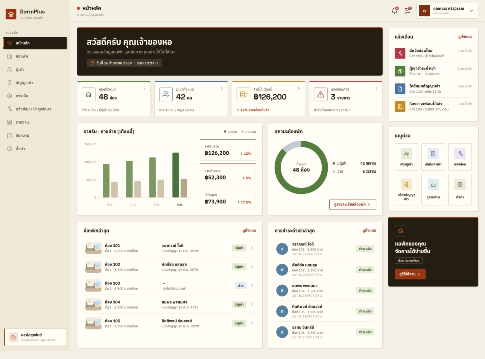

# DormPlus — ระบบจัดการหอพัก

DormPlus เป็นเว็บแอปสำหรับเจ้าของหอพัก ครอบคลุมห้องพัก ผู้เช่า สัญญาเช่า
การเงิน แจ้งซ่อม รายงาน ข้อความภายใน และการแจ้งเตือน
หน้าจอเป็นภาษาไทยทั้งหมด ตัวเลขทุกตัวบน Dashboard คำนวณจากฐานข้อมูลจริง

- **Frontend** — HTML5 + Vanilla JavaScript (ES modules) + Vanilla CSS ไม่ใช้ framework ไม่ต้อง build
- **Backend** — PHP 8.2+ REST API (Route → Controller → Service → Repository → SQLite)
- **Database** — SQLite ผ่าน PDO, prepared statements ทุกคำสั่ง, เปิด foreign keys



## สารบัญ

1. [ที่มาของโปรเจ็ค](#ที่มาของโปรเจ็ค)
2. [ความต้องการของระบบ](#ความต้องการของระบบ)
3. [ติดตั้ง](#ติดตั้ง)
4. [การตั้งค่า](#การตั้งค่า)
5. [รันบน PHP built-in server](#รันบน-php-built-in-server)
6. [รันบน Apache](#รันบน-apache)
7. [รันบน Nginx + PHP-FPM](#รันบน-nginx--php-fpm)
8. [ทดสอบ](#ทดสอบ)
9. [ภาพรวม API](#ภาพรวม-api)
10. [โครงสร้างโปรเจ็ค](#โครงสร้างโปรเจ็ค)

## ที่มาของโปรเจ็ค

DormPlus เป็นการทดลองพัฒนาซอฟต์แวร์ด้วย AI โดยเริ่มจาก **รูปภาพตัวอย่าง UI เพียงรูปเดียว**
(ภาพ mockup หน้า Dashboard ระบบจัดการหอพัก) ไม่มีโค้ดหรือดีไซน์ไฟล์ตั้งต้น

ขั้นตอนที่ใช้

1. **ส่งรูปตัวอย่างให้ AI** — นำภาพ mockup ไปให้ AI วิเคราะห์ว่าหน้าจอประกอบด้วยอะไรบ้าง
   (sidebar, การ์ดสถิติ, กราฟรายรับ-รายจ่าย, โดนัทสถานะห้อง, รายการห้อง/การชำระ, แจ้งเตือน, เมนูด่วน)
2. **ให้ AI เขียน prompt (สเปก) จากรูป** — AI แปลงสิ่งที่เห็นในภาพเป็นข้อกำหนดของระบบทั้งหมด
   ตั้งแต่เทคโนโลยีที่ใช้ (Vanilla JS + PHP + SQLite ไม่มี framework/build tool) โครงสร้างโปรเจ็ค
   โมดูลที่ต้องมี (ห้องพัก ผู้เช่า สัญญา การเงิน แจ้งซ่อม รายงาน ข้อความ ตั้งค่า) REST API
   ฐานข้อมูล ความปลอดภัย responsive ไปจนถึงลำดับการพัฒนาเป็น phase และรายการตรวจสอบก่อนส่งมอบ
3. **ให้ AI สร้างแอปตาม prompt และรูปตัวอย่าง** — ใช้ AI
   เขียนโค้ดทั้งหมดในโปรเจ็คนี้ โดยยึดรูปภาพเป็นแนวทางด้านการออกแบบ (สี ระยะห่าง ลำดับข้อมูล)
   และยึด prompt เป็นขอบเขตของฟีเจอร์ ข้อมูลตัวอย่างใน `database/seed.php` ถูกออกแบบให้
   Dashboard แสดงตัวเลขใกล้เคียงกับภาพต้นฉบับ (48 ห้อง ผู้เช่า 42 คน รายได้ประมาณ 126,000 บาท)
   แต่ทุกค่าคำนวณจาก SQLite จริง ไม่ได้เขียนตายตัวไว้ใน HTML
4. **ตรวจสอบและแก้ไข** — AI รันชุดทดสอบ API, เปิดหน้าจอจริงผ่าน headless browser เทียบกับรูปตัวอย่าง
   และแก้ไขจนหน้าตาและการทำงานตรงตามที่กำหนด

ผลลัพธ์ที่ได้คือแอปที่ใช้งานได้จริงตามภาพด้านบน ไม่ใช่เพียง static mockup

## ความต้องการของระบบ

- PHP 8.2 ขึ้นไป พร้อม extension `pdo_sqlite`, `mbstring`, `ctype`, `json`
  (`curl` ใช้เฉพาะตอนรันชุดทดสอบ)
- เว็บเซิร์ฟเวอร์อย่างใดอย่างหนึ่ง: PHP built-in server, Apache (mod_rewrite) หรือ Nginx + PHP-FPM
- **ไม่ต้องใช้** Composer, Node.js หรือ bundler

## ติดตั้ง

```bash
git clone https://github.com/goragodwiriya/DormPlus DormPlus
cd DormPlus

php database/migrate.php   # สร้างตารางใน database/database.sqlite
php database/seed.php      # ใส่ข้อมูลตัวอย่าง (หอพัก 48 ห้อง ผู้เช่า 42 คน)
php -S localhost:8000 -t public public/router.php
```

เปิด http://localhost:8000 แล้วเข้าสู่ระบบด้วย

| ชื่อผู้ใช้ | รหัสผ่าน | บทบาท |
| --- | --- | --- |
| `admin` | `DormPlus@2026` | เจ้าของหอพัก |
| `nattaya` | `DormPlus@2026` | ผู้ดูแลระบบ (บัญชี) |
| `somchai` | `DormPlus@2026` | พนักงาน (ช่าง) |

กำหนดรหัสผ่านเองได้ตอน seed: `DORMPLUS_ADMIN_PASSWORD='รหัสของคุณ' php database/seed.php`
(ใช้กับทั้ง 3 บัญชี) และเปลี่ยนได้ภายหลังที่เมนู **ตั้งค่า → บัญชีผู้ใช้**

โฟลเดอร์ `database/`, `storage/logs/` และ `uploads/` ต้องเขียนได้โดยผู้ใช้ที่รัน PHP

> รัน `php database/seed.php` ซ้ำได้ทุกเมื่อ — จะล้างข้อมูลเดิมและใส่ข้อมูลตัวอย่างใหม่ทั้งหมด

## การตั้งค่า

ค่าทั้งหมดอยู่ใน [config/config.php](config/config.php) และอ่านจาก environment variable ได้

| ตัวแปร | ค่าเริ่มต้น | ความหมาย |
| --- | --- | --- |
| `APP_ENV` | `development` | สภาพแวดล้อม |
| `APP_DEBUG` | `false` | `true` เพื่อแสดง error ของ PHP (ใช้เฉพาะตอนพัฒนา) |
| `APP_URL` | `http://localhost:8000` | URL ของแอป ใช้สำหรับ CORS allow-list |
| `DB_PATH` | `database/database.sqlite` | ตำแหน่งไฟล์ SQLite |
| `SESSION_SECURE` | `false` | ตั้ง `true` เมื่อใช้ HTTPS เพื่อให้ cookie ส่งเฉพาะ HTTPS |

เขตเวลาเป็น `Asia/Bangkok` (ตั้งใน `config.php` และส่งต่อให้ SQLite ผ่าน `TZ`)
วันที่ในฐานข้อมูลเก็บแบบ `YYYY-MM-DD` / `YYYY-MM-DD HH:MM:SS` ตามเวลาท้องถิ่น

## รันบน PHP built-in server

```bash
php -S localhost:8000 -t public public/router.php
```

`public/router.php` ทำหน้าที่แทน `.htaccess`: ส่ง `/api/*` ไปที่ API และเส้นทางอื่นไปที่ `index.html`

## รันบน Apache

ต้องเปิด `mod_rewrite` และอนุญาต `AllowOverride All` (ไฟล์ `public/.htaccess` จัดการ rewrite ให้)

**แบบที่ 1 — VirtualHost ชี้ที่ `public/` (แนะนำ)**

```apache
<VirtualHost *:80>
    ServerName dormplus.test
    DocumentRoot /var/www/DormPlus/public

    <Directory /var/www/DormPlus/public>
        AllowOverride All
        Require all granted
    </Directory>

    # ป้องกันการเข้าถึงไฟล์นอก public
    <DirectoryMatch "/(database|storage|config|api/(?!index\.php))">
        Require all denied
    </DirectoryMatch>

    ErrorLog ${APACHE_LOG_DIR}/dormplus-error.log
</VirtualHost>
```

**แบบที่ 2 — วางใน subdirectory** เช่น `http://localhost/DormPlus/public/`
ไม่ต้องตั้งค่าเพิ่ม แอปตรวจจับโฟลเดอร์ที่ติดตั้งเองทั้งฝั่ง JS (`assets/js/core/Paths.js`)
และ PHP (`Request::basePath()`) ไฟล์ `index.html` ที่โฟลเดอร์รากจะ redirect ไปยัง `public/` ให้

## รันบน Nginx + PHP-FPM

```nginx
server {
    listen 80;
    server_name dormplus.test;
    root /var/www/DormPlus/public;
    index index.html;

    charset utf-8;

    # ไฟล์ static
    location /assets/ {
        expires 7d;
        access_log off;
    }

    # REST API → api/index.php
    location /api/ {
        try_files $uri /api/index.php$is_args$args;
    }

    location = /api/index.php {
        include fastcgi_params;
        fastcgi_pass unix:/run/php/php8.2-fpm.sock;
        fastcgi_param SCRIPT_FILENAME $document_root/api/index.php;
    }

    # SPA: เส้นทางอื่นทั้งหมดไป index.html
    location / {
        try_files $uri $uri/ /index.html;
    }

    # ห้ามรันไฟล์ PHP อื่น
    location ~ \.php$ {
        return 404;
    }

    location ~ /\. {
        deny all;
    }
}
```

## ทดสอบ

```bash
php tests/ApiTest.php
```

ชุดทดสอบจะสร้างฐานข้อมูลชั่วคราว, รัน migration + seed, เปิด PHP server บนพอร์ตว่าง
แล้วทดสอบ API จริง 80 รายการ (login, CRUD ห้อง/ผู้เช่า, transaction ของสัญญา, การชำระเงิน,
งานซ่อม, การแจ้งเตือน, รายงาน, ข้อความ, การตรวจสอบข้อมูล, สิทธิ์การเข้าถึง, foreign key)
ไม่กระทบฐานข้อมูลที่ใช้งานอยู่

## ภาพรวม API

ทุก endpoint อยู่ใต้ `/api` รับ-ส่ง JSON และต้องเข้าสู่ระบบก่อน (ยกเว้น `/api/auth/login`, `/api/health`)
คำขอที่เปลี่ยนแปลงข้อมูล (POST/PUT/DELETE) ต้องส่ง header `X-CSRF-Token` ที่ได้จากตอน login

| กลุ่ม | Endpoint หลัก |
| --- | --- |
| Auth | `POST /auth/login`, `GET /auth/me`, `POST /auth/logout`, `PUT /auth/password`, `PUT /auth/profile` |
| Dashboard | `GET /dashboard`, `/dashboard/statistics`, `/dashboard/financial-summary`, `/dashboard/financial-chart`, `/dashboard/room-status`, `/dashboard/notifications` |
| ห้องพัก | `GET/POST /rooms`, `GET/PUT/DELETE /rooms/{id}`, `PUT /rooms/{id}/status`, `GET /rooms/options` |
| ผู้เช่า | `GET/POST /tenants`, `GET/PUT/DELETE /tenants/{id}`, `GET /tenants/options` |
| สัญญาเช่า | `GET/POST /contracts`, `GET/PUT/DELETE /contracts/{id}`, `PUT /contracts/{id}/end`, `POST /contracts/{id}/renew`, `GET /contracts/expiring` |
| การเงิน | `GET/POST /payments`, `GET/PUT/DELETE /payments/{id}`, `PUT /payments/{id}/cancel`, `GET /payments/summary`, `GET/POST /expenses`, `GET/PUT/DELETE /expenses/{id}` |
| แจ้งซ่อม | `GET/POST /maintenance`, `GET/PUT/DELETE /maintenance/{id}`, `PUT /maintenance/{id}/status` |
| รายงาน | `GET /reports/income`, `/reports/expenses`, `/reports/profit`, `/reports/occupancy`, `/reports/payments`, `/reports/tenants`, `/reports/maintenance`, `/reports/contracts` |
| แจ้งเตือน | `GET /notifications`, `PUT /notifications/{id}/read`, `PUT /notifications/read-all`, `DELETE /notifications/{id}` |
| ข้อความ | `GET/POST /messages/threads`, `GET/POST /messages/threads/{id}`, `PUT /messages/threads/{id}/read`, `GET /messages/unread-count`, `GET /messages/recipients` |
| ตั้งค่า | `GET /settings`, `PUT /settings/property`, `PUT /settings/rental`, `PUT /settings/system` |

รายละเอียดพารามิเตอร์ ตัวอย่างคำขอ/คำตอบ และรหัสข้อผิดพลาดอยู่ที่ [docs/API.md](docs/API.md)
โครงสร้างฐานข้อมูลอยู่ที่ [docs/DATABASE.md](docs/DATABASE.md)

## โครงสร้างโปรเจ็ค

```
DormPlus/
├── api/
│   ├── index.php            จุดเข้า API: session, CORS, DI, routing, error handling
│   ├── routes/              นิยาม endpoint แยกตามโมดูล
│   ├── controllers/         อ่าน request → เรียก service → ส่ง response
│   ├── services/            กฎธุรกิจ การตรวจสอบข้อมูล และ transaction
│   ├── repositories/        คำสั่ง SQL (prepared statements) ต่อตาราง
│   ├── middleware/          AuthMiddleware, CsrfMiddleware
│   └── core/                Router, Request, Response, Validator, Pagination, Exceptions
├── config/
│   ├── config.php           การตั้งค่าแอป (อ่านจาก environment)
│   └── Database.php         การเชื่อมต่อ PDO/SQLite
├── database/
│   ├── migrations/          สคีมา SQL
│   ├── migrate.php          รัน migration ที่ยังไม่เคยรัน
│   ├── seed.php             ข้อมูลตัวอย่าง
│   └── database.sqlite      ไฟล์ฐานข้อมูล (สร้างตอน migrate, ไม่อยู่ใน git)
├── public/                  DocumentRoot
│   ├── index.html           SPA shell
│   ├── router.php           router สำหรับ php -S
│   ├── .htaccess            rewrite สำหรับ Apache
│   ├── api/index.php        ทางเข้า API สำหรับเว็บเซิร์ฟเวอร์
│   └── assets/
│       ├── css/app.css      สไตล์ทั้งหมด (responsive, ไม่มี framework)
│       ├── images/          ภาพประกอบ SVG ในเครื่อง
│       └── js/
│           ├── main.js      App: เชื่อม router กับโมดูล
│           ├── core/        ApiClient, Router (hash), StateManager, Paths
│           ├── ui/          Modal, Form, Table, Pagination, Badge, Charts, Toast, ...
│           └── modules/     Dashboard, Rooms, Tenants, Contracts, Payments, Maintenance,
│                            Reports, Messages, Notifications, Settings, Shell, Auth
├── storage/logs/            PHP error log
├── uploads/                 ไฟล์อัปโหลด (สำรองไว้)
├── tests/ApiTest.php        ชุดทดสอบ API
├── docs/                    API.md, DATABASE.md
└── bootstrap.php            autoloader, timezone, error logging
```

## ความปลอดภัยที่มีให้

- PDO prepared statements ทุกคำสั่ง ไม่มีการต่อสตริง SQL กับข้อมูลผู้ใช้
- ตรวจสอบข้อมูลทั้งฝั่ง client (ฟอร์ม) และฝั่ง server (`Validator`) — server เป็นตัวตัดสิน
- Session-based authentication, `password_hash()` / `password_verify()`
- CSRF token ต่อ session สำหรับทุกคำขอที่แก้ไขข้อมูล
- Cookie เป็น `HttpOnly` + `SameSite=Lax` (เปิด `Secure` ด้วย `SESSION_SECURE=true`)
- ฝั่ง frontend สร้าง DOM ด้วย `textContent`/`createElement` ไม่ใส่ข้อมูลผู้ใช้ผ่าน `innerHTML`
- ข้อผิดพลาดของระบบบันทึกที่ `storage/logs/php-error.log` และตอบผู้ใช้ด้วยข้อความทั่วไป
